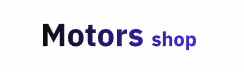

# Motors Shop

<!---Esses são exemplos. Veja https://shields.io para outras pessoas ou para personalizar este conjunto de escudos. Você pode querer incluir dependências, status do projeto e informações de licença aqui--->

> We are making a site app where you can make auctions and make bids on automobiles. It's a full-stack project working with React and Express together for our goals.

### Updates and Goals:

The Projecty are still on working, the next updates are: 

- [x] HomePage
- [x] User Profile
- [x] Announcement Page
- [x] Login
- [ ] Modal for announcement/ auction register
- [ ] User Register

## 🤝 DEVs

<table>
  <tr>
    <td align="center">
      <a href="#">
         
        
          <b>Juan Rego</b>
        
      </a>
    </td>
    <td align="center">
      <a href="#">
         
        
          <b>Guilherme Silva</b>
        
      </a>
    </td>
    
  </tr>
</table>
